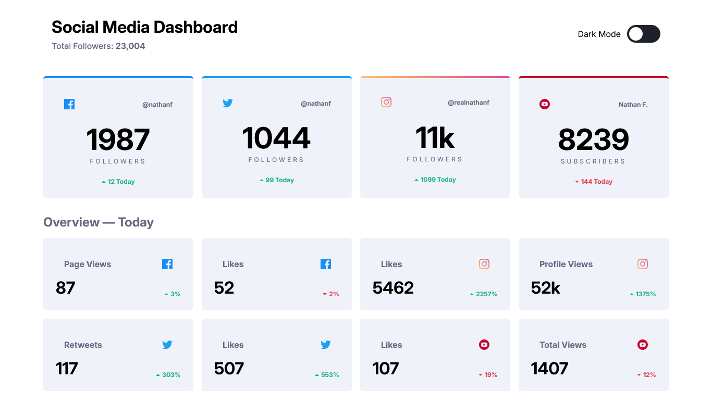
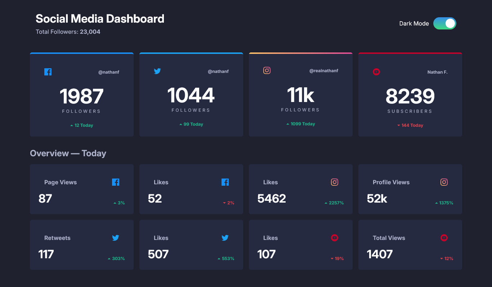

# Social media dashboard with theme switcher solution

## Table of contents

- [Overview](#overview)
  - [Screenshot](#screenshot)
  - [Links](#links)
- [My process](#my-process)
  - [Built with](#built-with)
  - [Useful resources](#useful-resources)
- [Author](#author)

## Overview

### Screenshot

### Links

- Solution URL: [Solution](https://github.com/shaheerahmedkhan11/social-media-dashboard-with-theme-switcher)
- Live Site URL: [Live Site](https://shaheerahmedkhan11.github.io/social-media-dashboard-with-theme-switcher/)

## My process

### Built with

- Semantic HTML5 markup
- CSS custom properties
- Flexbox
- CSS Grid
- Mobile-first workflow
- [Styled Components](https://styled-components.com/) - For styles

### Useful resources

- [MDN Web Docs](https://developer.mozilla.org/en-US/)
- [CSS Tricks](https://css-tricks.com/)

## Author

- Website - [ShaheerAhmedKhan](https://www.your-site.com)
- Frontend Mentor - [@shaheerahmedkhan11](https://www.frontendmentor.io/profile/shaheerahmedkhan11)
